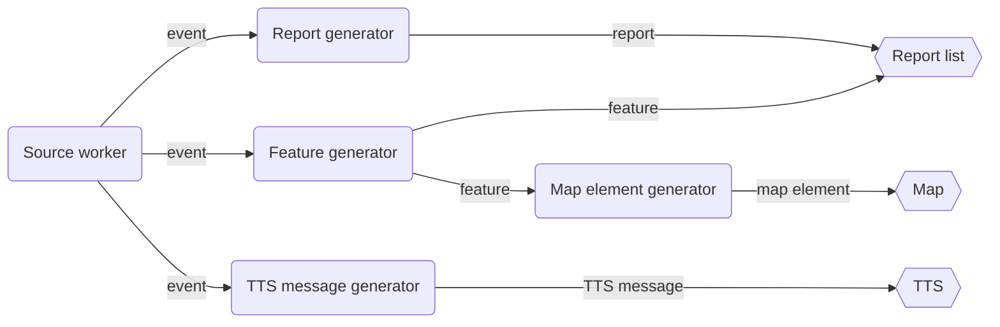

# Basic Concepts
CysTerra processes an event with the following pipeline.

An **event source** is a source from which CysTerra retrieves geoharzard information.

An **event** is a whole set or a subset of information published by an event source at a time.

A **source worker** is a component that manages the connection to an event source and fetches events from it.

A **generator** is a component that generates objects of a specific type from input objects of another specific type.

A **report** is a summary of an event.

A **report generator** is a generator that generates reports from events.

A **feature** is a detailed representation of an event.

A **feature generator** is a generator that generates features from events.

A **TTS message** is a text message spoken by a TTS engine.

A **TTS message generator** is a generator that generates TTS messages from events.
